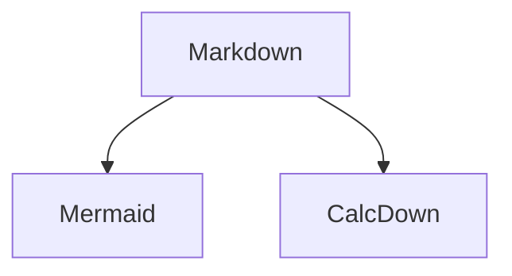

# Notebook example (mixed Markdown + CalcDown)

This is a `.md` **notebook**: narrative Markdown + arbitrary code fences + CalcDown blocks.

CalcDown blocks are **opt-in** using explicit fences:

- `calcdown inputs` / `calcdown data` / `calcdown calc` / `calcdown view`
- also supported: `calcdown:<kind>` (example: `calcdown:view`)

<!-- This HTML comment will not render. -->
%% This line comment will not render either.



```view
This is *not* a CalcDown view block — it’s just a Markdown code fence whose language tag is `view`.
In notebook mode, only `calcdown view` fences are treated as CalcDown.
```

## Model

```calcdown inputs
people : integer = 2
days   : integer = 5
```

```calcdown inputs
daily_food    : Currency[USD] = 45
lodging_night : Currency[USD] = 120
misc          : Currency[USD] = 200
tax_rate      : percent       = 8.25
```

```calcdown data
name: extras
primaryKey: id
sortBy: name
columns:
  id: string
  name: string
  cost: Currency[USD]
---
{"id":"x1","name":"Museum tickets","cost":38}
{"id":"x2","name":"Souvenirs","cost":25}
```

```calcdown calc
const food_total = people * days * daily_food;
const lodging_total = days * lodging_night;
const extras_total = std.math.sum(extras.cost);
const subtotal = food_total + lodging_total + extras_total + misc;
const tax = subtotal * (tax_rate / 100);
const total = subtotal + tax;
const per_person = total / people;
```

```calcdown calc
const breakdown = [
  { "category": "Food", "amount": food_total },
  { "category": "Lodging", "amount": lodging_total },
  { "category": "Extras", "amount": extras_total },
  { "category": "Misc", "amount": misc },
  { "category": "Tax", "amount": tax }
];
```

```calcdown view
[
  {
    "id": "summary",
    "library": "calcdown",
    "type": "cards",
    "spec": {
      "title": "Trip budget",
      "items": [
        { "key": "food_total", "label": "Food" },
        { "key": "lodging_total", "label": "Lodging" },
        { "key": "extras_total", "label": "Extras" },
        { "key": "misc", "label": "Misc" },
        { "key": "tax", "label": "Tax" },
        { "key": "total", "label": "Total" },
        { "key": "per_person", "label": "Per person" }
      ]
    }
  },
  {
    "id": "extras_table",
    "library": "calcdown",
    "type": "table",
    "source": "extras",
    "spec": { "title": "Extras (editable)", "editable": true }
  },
  {
    "id": "breakdown_chart",
    "library": "calcdown",
    "type": "chart",
    "source": "breakdown",
    "spec": {
      "title": "Breakdown",
      "kind": "bar",
      "x": { "key": "category", "label": "Category" },
      "y": { "key": "amount", "label": "Amount", "format": "currency" }
    }
  }
]
```

```calcdown:view
{
  "id": "main",
  "library": "calcdown",
  "type": "layout",
  "spec": {
    "title": "Notebook demo (CalcDown 1.0)",
    "direction": "column",
    "items": [
      { "ref": "summary" },
      { "ref": "extras_table" },
      { "ref": "breakdown_chart" }
    ]
  }
}
```

